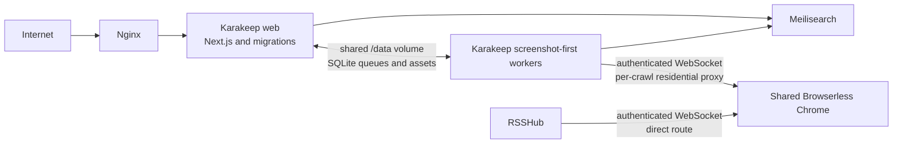

# Screenshot-first lightweight VPS deployment

## Status

Proposed and user-approved for implementation planning. This document records the deployment contract for the Karakeep fork's production VPS.

## Problem

The current production deployment at `~/karakeep-fork` runs one all-in-one Karakeep container, a dedicated Chrome container, Meilisearch, and Watchtower. The all-in-one container starts the Next.js server and every worker.

Observed live baseline on 2026-07-12:

| Process or service | Observed memory |
| --- | ---: |
| Next.js server | about 303 MiB RSS |
| Generic Karakeep worker process | about 199 MiB RSS |
| Karakeep Chrome | about 86 MiB idle |
| Meilisearch | about 35 MiB idle |
| Watchtower | about 27 MiB idle |

The objective is a lower, bounded same-VPS footprint. This design does not promise a 512 MiB reduction: the Next.js and worker processes alone consume about 500 MiB RSS. It removes duplicate Chromium and reduces unnecessary persistent worker work while preserving the selected product behavior.

## Product contract

### Preserve

- Screenshot-first link capture.
- Per-crawl residential proxy routing for every Karakeep browser-rendered capture.
- Reader Mode over extracted HTML.
- Private HTML extraction for Reader Mode, automatic tags, and automatic summaries.
- Automatic tags and summaries after capture closes the renderer session.
- Search indexing.
- Scheduled backups.
- RSS feed refresh.
- Rules and outbound webhooks.
- Manual imports.
- Asset preprocessing for uploaded-image OCR and PDF-derived previews, limited to one concurrent job.

### Disable or remove from normal operation

- Automatic embeddings and semantic vector indexing.
- Embedding activity in the header processing indicator.
- URL PDF capture.
- Full-page archive capture.
- Video downloading.
- Karakeep's dedicated Chrome container.
- Resident admin-maintenance processing.

## Deployment architecture



### Karakeep services

Production Compose runs these services:

- `web`, built from Docker's existing `web` target. It runs database migrations and the Next.js application only.
- `workers`, built from Docker's existing `workers` target and started through a dedicated screenshot-first entrypoint.
- `meilisearch`.
- `watchtower`, configured to update both Karakeep services.

`web` and `workers` share the existing `/data` volume. SQLite, assets, and queues stay local to the VPS. `workers` waits for a healthy `web` service so migrations finish before it starts processing jobs.

Meilisearch stays private to the Karakeep network. Nginx continues to reach only the web service through its localhost bind. No worker, Meilisearch, or Browserless port is published to the host.

### Shared renderer

Browserless is one token-protected `browserless/chrome` service shared by RSSHub and Karakeep. It is attached to a dedicated internal Docker network alongside only its trusted clients. It is never host-published.

Initial Browserless guardrails:

```text
CONCURRENT=2
QUEUED=4
TIMEOUT=45000
TOKEN=<shared secret>
```

Karakeep and RSSHub each receive the token through their own secret environment configuration. The token is never included in source control or logs.

## Renderer connector and proxy isolation

Add a small Karakeep connector layer, not a new microservice. It owns the Browserless connection lifecycle and consumes separate configuration values:

```dotenv
BROWSERLESS_URL=ws://shared-browserless:3000
BROWSERLESS_TOKEN=<secret>
BROWSER_CONNECT_ONDEMAND=true
```

The connector constructs an authenticated WebSocket endpoint, redacts it in logs, creates a Browserless session per crawl, and closes that session after capture. The exact Browserless WebSocket path and token parameter are validated against the installed self-hosted Browserless version before cutover.

Karakeep continues to choose one configured residential proxy per crawl run. The connector applies that proxy, including authentication, to the crawl's isolated Playwright context. Browserless itself never receives or stores residential proxy credentials. RSSHub sessions continue to use RSSHub's direct network route.

## Screenshot-first worker profile

The new screenshot-first entrypoint imports and starts only these resident capabilities:

```text
crawler
lowPriorityCrawler
inference
search
feed
ruleEngine
webhook
backup
import
assetPreprocessing
```

It excludes these capabilities from resident operation:

```text
embeddings
video
adminMaintenance
```

Asset preprocessing remains resident with one concurrent worker because it preserves useful future-user behavior. Its costly OCR and PDF-preview work occurs only while a job runs. The profile retains the runtime dependencies required for that behavior.

Admin maintenance becomes a documented one-shot command. It starts the maintenance handler only for an explicit cleanup or upgrade migration and exits after the requested work drains. It is not part of ordinary bookmark processing.

The production policy is explicit:

```dotenv
EMBEDDING_ENABLE_AUTO_INDEXING=false
INFERENCE_ENABLE_AUTO_TAGGING=true
INFERENCE_ENABLE_AUTO_SUMMARIZATION=true

CRAWLER_STORE_SCREENSHOT=true
CRAWLER_FULL_PAGE_SCREENSHOT=false
CRAWLER_STORE_PDF=false
CRAWLER_FULL_PAGE_ARCHIVE=false
CRAWLER_VIDEO_DOWNLOAD=false
ASSET_PREPROCESSING_NUM_WORKERS=1
```

The same explicit embedding setting belongs in `.env.sample`, preventing an upstream default change from enabling vector work unexpectedly.

## Capture lifecycle

1. A user saves a link. Karakeep persists the bookmark immediately and queues capture work.
2. The worker selects one residential proxy for the crawl.
3. The connector creates a token-authenticated Browserless session and applies that proxy only to the Playwright context for this crawl.
4. The crawler fetches and extracts HTML, stores a normal viewport screenshot, and closes the page, context, and Browserless session.
5. Parsed HTML remains available to Reader Mode and is passed to asynchronous tagging and summarization.
6. Tagging and summarization complete after the renderer session closes.
7. Search indexing follows. Automatic embeddings are not generated or queued.

When Browserless is at capacity or a renderer session times out, the bookmark remains saved. Karakeep treats the failure as retryable with bounded backoff. Final screenshot failure does not discard bookmark metadata, extracted HTML, Reader Mode, tags, summaries, or search eligibility.

## Embedding status correction

Live production inspection found that automatic embedding is disabled and the queue contains zero tasks, but 854 bookmarks still have `embeddingStatus = 'pending'`. The header indicator therefore shows a stale database-state count rather than active work.

The implementation must:

1. Confirm the embeddings queue is empty before cleanup.
2. Clear only stale `embeddingStatus = 'pending'` rows.
3. Exclude embedding work from the screenshot-first entrypoint.
4. Remove embedding from the header processing indicator's active-task contract.

This is a correctness fix, not an attempt to hide active work. In the screenshot-first profile, embeddings are deliberately disabled and never an active processing state.

## Image build and update contract

The existing CI workflow currently publishes only the `aio` Docker target. It must publish independently versioned web and worker targets from the same commit:

```text
ghcr.io/absolutepraya/karakeep:web-main
ghcr.io/absolutepraya/karakeep:workers-main
```

Compose uses those images for `web` and `workers`, and Watchtower updates both labels. Both tags are produced from the same commit so web and workers remain protocol-compatible.

## Rollout and rollback

1. Build and publish web and worker targets without changing the live browser path.
2. Create the internal shared-renderer network.
3. Token-protect Browserless, update RSSHub to authenticate, and confirm its existing rendering works.
4. Add the Karakeep renderer connector while keeping Karakeep's current Chrome service alive.
5. Run a disposable, proxy-routed capture and validate screenshot storage, extracted Reader Mode content, tags, summaries, search indexing, session closure, and proxy egress without credential logging.
6. Exercise controlled renderer saturation and verify queueing plus bounded retry rather than bookmark loss.
7. Measure idle and active-crawl memory with `docker stats` for web, workers, Meilisearch, and Browserless.
8. Cut over to the shared renderer only after all validation gates pass.
9. Remove Karakeep's dedicated Chrome service after a stable observation window.

Rollback consists of restoring the previous Karakeep Compose revision and Chrome configuration while retaining the shared renderer unchanged. The dedicated Chrome service remains available until the shared path has passed validation.

## Verification

Implementation is complete only when all of the following pass:

- focused tests for the Browserless connector, authenticated endpoint construction, token redaction, and retry classification
- focused test that embeddings are absent from the header processing-status contract
- test that stale embedding statuses are cleared only when no embedding queue jobs exist
- Docker Compose configuration validation
- authenticated Browserless smoke test, including rejected tokenless access
- RSSHub renderer regression smoke test
- Karakeep proxy-route smoke test using a disposable IP-reporting URL without exposing credentials
- capture lifecycle test: screenshot, Reader Mode content, tag, summary, and search
- asset preprocessing test for uploaded image OCR or PDF preview with one worker
- controlled Browserless saturation test
- before-and-after idle and active-crawl `docker stats` measurements

## Out of scope

- Moving Karakeep, SQLite, or Meilisearch off the VPS.
- Rewriting Next.js or replacing the Karakeep product architecture.
- Enabling automatic embeddings or semantic vector search.
- Adding a public Browserless endpoint.
- Sharing Karakeep residential proxy credentials or routing RSSHub through the residential proxy.
